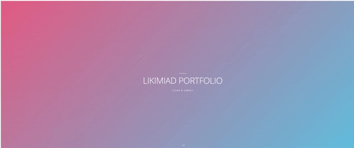
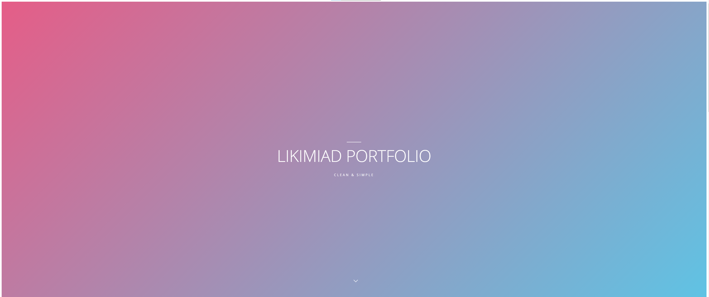
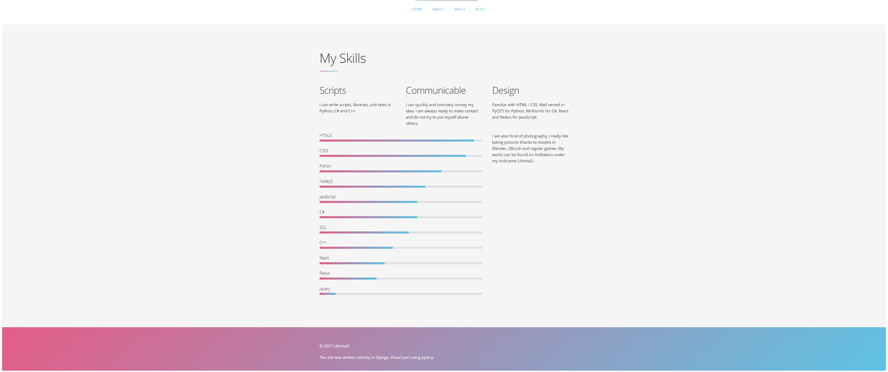
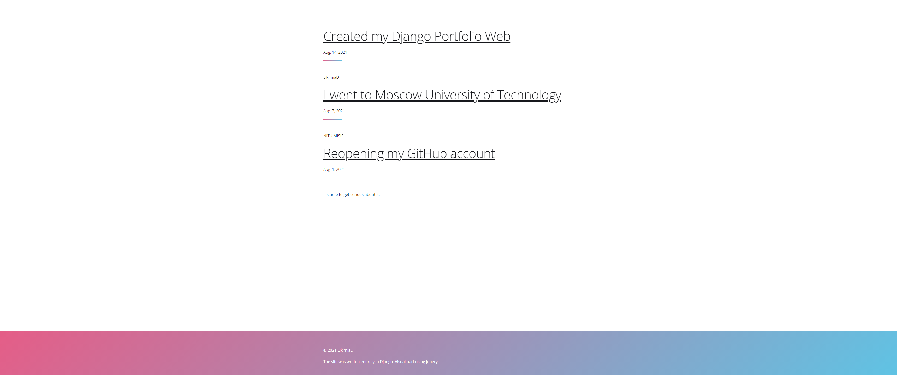
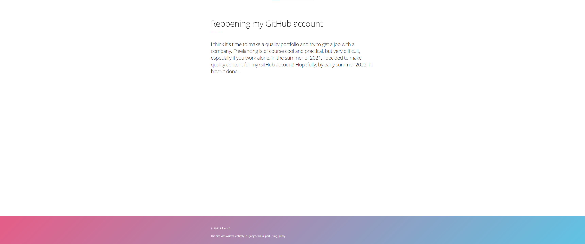
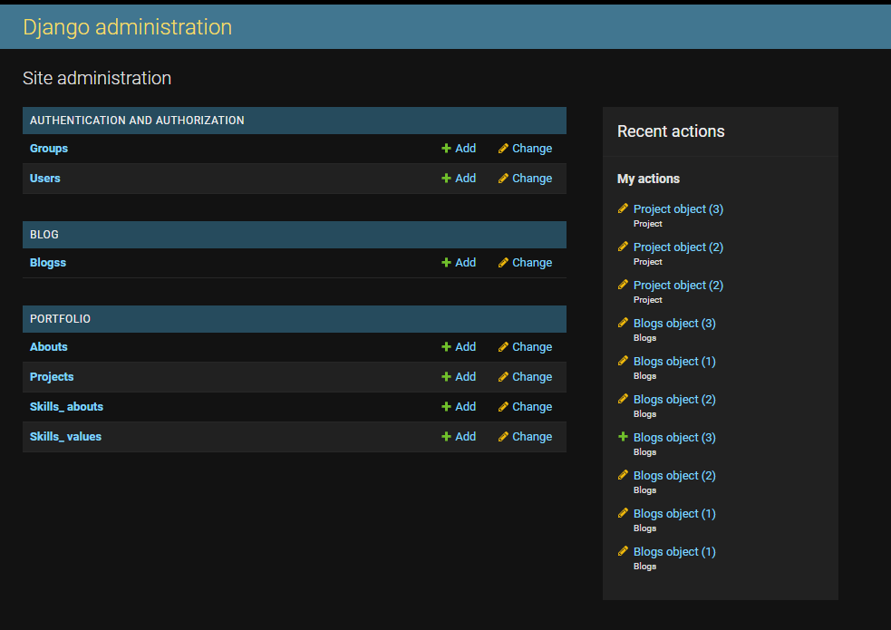
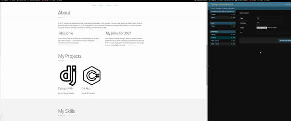

# Django Portfolio Website
***Front-End part uses JS and jQuery library***
## Preview







# Admin Panel

### The "About", "My Projects", "My Skills", and "Blogs" tabs are filled out through the admin terminal (url/admin).
***There is no need to add anything to the HTML file, the site itself aligns everything to its grid.***
```
login: likimiad
password: 12345678
```

### Portfolio Model options:
- Abouts
    * title (Column name)
    * desription (Brief description, pictures below)
    * image (The photo is compressed to 200x200)
    * url
- About
    * title (Column name)
    * desription (max 300 characters)
- Skill About
    * title (Column name)
    * desription (max 500 characters)
- Skill Value
    * title (programming language)
    * value (value from 0 to 100 in increments of 5 |0, 5, 10, etc.|)

### Blog Model options:
***After adding a new Blog, you don't need to change the url.py document, it takes you to the universal detail link and by id***
-  Blogs
    * title (Column name)
    * small desription (Description of the link in the all_blogs/ tab)
    * full desription (Full description, opens in a separate tab that shows title and full description)
    * date 

# How to install
```py
>>> cd folder_path
>>> python3 -m venv venv
>>> .\venv\Scripts\Activate #The note (venv) should appear
>>> pip install Django
>>> pip install Pillow #To process photos
>>> python3 manage.py runserver
```